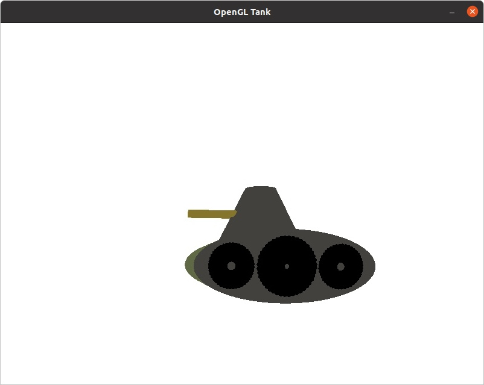
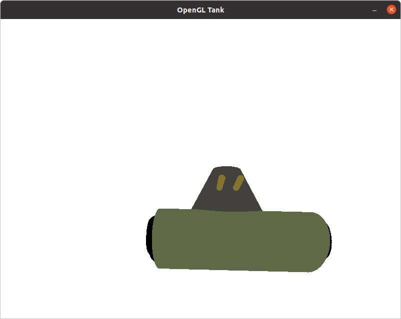

## OpenGL Tank
Использованные библиотеки:
* [go-gl](https://github.com/go-gl/gl)
* [glfw](https://github.com/go-gl/glfw)
* [mathgl](https://github.com/go-gl/mathgl)

Сцена состоит из камеры, танк собран из следующих фигур:
* цилиндр
* тор
* усеченный конус

## Сцена

### Использованные источники
* https://github.com/go-gl/example
* http://www.songho.ca/
* https://learnopengl.com/
* Книга Виктора Порева - Компьютерная графика